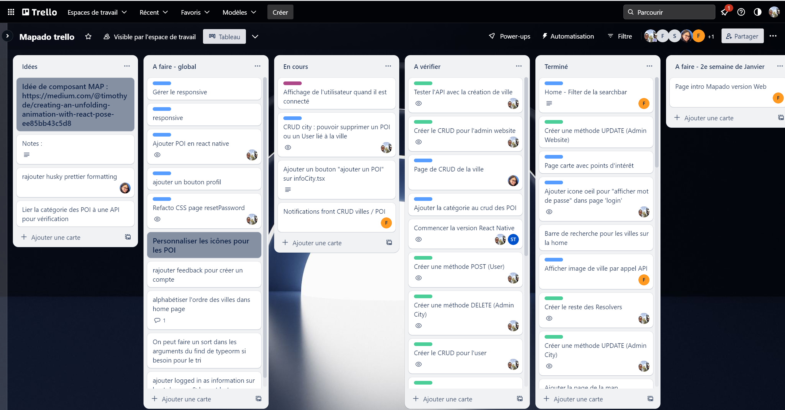

# Titre de la compétence

> ❌ A travailler

> ✔️ Auto validation par l'étudiant

## 🎓 J'ai compris et je peux expliquer

- Différence entre Agile et SCRUM ✔️

  Agile est une philosophie de développement logiciel qui favorise la flexibilité, la collaboration et la satisfaction du client. 
  Scrum est une méthodologie spécifique de gestion de projet qui s'inscrit dans l'approche Agile. Elle utilise des itérations appelées "sprints" pour organiser le travail de l'équipe de développement, avec une attention particulière sur la transparence, l'inspection et l'adaptation.

- Expliquer les différents rituels et leur intérêt : ✔️

  * Daily Stand Up : réunion quotidienne où chacun explique l'avancement de son travail et les problèmes rencontrés.

  * Sprint planning : l'objectif est de décider des éléments du backlog à traiter en priorité sur le prochain sprint.

  * Retro : retour sur le sprint terminé pour en faire un bilan et essayer d'améliorer les suivants.

  * Grooming : le but est de valider la faisabilité technique d'une tâche, de la découper (grooming) en plusieurs tâches plus petites et établir une estimation de réalisation.

  * Poker planning : c'est méthode d’estimation collaborative où les membres de l'équipe utilisent des cartes numérotées pour évaluer l'effort requis pour accomplir une tâche.

- Expliquer les différents roles ✔️
  * SCRUM master : il est responsable de faciliter la mise en œuvre de Scrum au sein de l'équipe de développement. Il agit comme un leader et s'assure que les principes et les processus Scrum sont compris et suivis. Il aide à éliminer les obstacles qui entravent le progrès de l'équipe et facilite les réunions Scrum.
  
  * Product Owner : il est responsable de la définition et de la priorisation du backlog du produit. Il s'assure que les besoins des utilisateurs sont compris et intégrés dans le développement du produit. Il prend les décisions concernant les fonctionnalités à développer, les priorités et les livrables.
  
  * Stakeholder : ce sont les parties prenantes qui ont un intérêt ou une influence sur le produit en cours de développement. Ils peuvent inclure les clients, les utilisateurs finaux, les gestionnaires de projet, les équipes marketing, les équipes de support, ... Les stakeholders fournissent des informations, des retours d'expérience et des exigences au Product Owner, et sont impliqués dans les revues de sprint pour donner des commentaires sur le produit en cours de développement.

- Comment rédiger une User Story complète ? ✔️

  Une User Story se rédige souvent de la façon suivante :
  `En tant que <role> je peux ...`
  Par exemple : 
  `En tant qu'utilisateur je peux consulter la liste des produits et accéder au détail d'un produit pour en voir les caractéristiques, prix...`

- Qu'est-ce qu'un Product Backlog ? ✔️

  C'est la liste ordonnée de toutes les fonctionnalités, améliorations et tâches à réaliser pour un produit, priorisées en fonction de la valeur qu'elles apportent. Il est utilisé lors des sprint planning pour sélectionner les éléments à inclure dans le prochain sprint.

- Qu'est-ce qu'un Sprint ? Quel est l'intérêt ? ✔️

  Le sprint regroupe un ensemble de tâches du backlog à traiter en priorité. Il permet une livraison itérative de fonctionnalités, une meilleure planification, une inspection et une adaptation continues, ainsi qu'une transparence et une collaboration accrues entre l'équipe de développement et les parties prenantes.

- A quoi sert le Burndown Chart ? ✔️

  C'est un graphique qui permet de comparer le reste du travail à effectuer par rapport au travail effectué. 

- Quelles sont les 2 unités de complexité ? ✔️

  On peut utiliser soit la suite de Fibonnacci, ou une échelle de type S, M, L, XL.

- Qu'est-ce qu'une Definition of done ? À quoi sert-elle ? ✔️

  On définit ce qui attendu lors de la réalisation d'une fonctionnalité, avec un ensemble de tâches. Cela permet de visualiser l'état de l'avancement.

## 💻 J'utilise

### Un exemple personnel commenté ❌ 

### Utilisation dans un projet ✔️

- [Lien du trello](https://trello.com/b/NpnI4p3W/mapado-trello)
  Trello du projet Mapado

### Utilisation en production si applicable ❌ 

### Utilisation en environnement professionnel ✔️

Description : Utilisation de Jira 

## 🌐 J'utilise des ressources

### Titre

- [The Scrum Guide](https://www.scrum.org/resources/scrum-guide)
  Ressources SCRUM

- [Méthode SCRUM](https://ignition-program.com/tuto/la-methode-scrum-pour-les-nuls)
  Résumé du SCRUM

- [Méthode Agile](https://asana.com/fr/resources/agile-methodology)
  Résumé de la méthode Agile

## 🚧 Je franchis les obstacles

### Point de blocage ✔️

## 📽️ J'en fais la démonstration

- J'ai écrit un [tutoriel]() ❌ 
- J'ai fait une [présentation]() ❌ 
