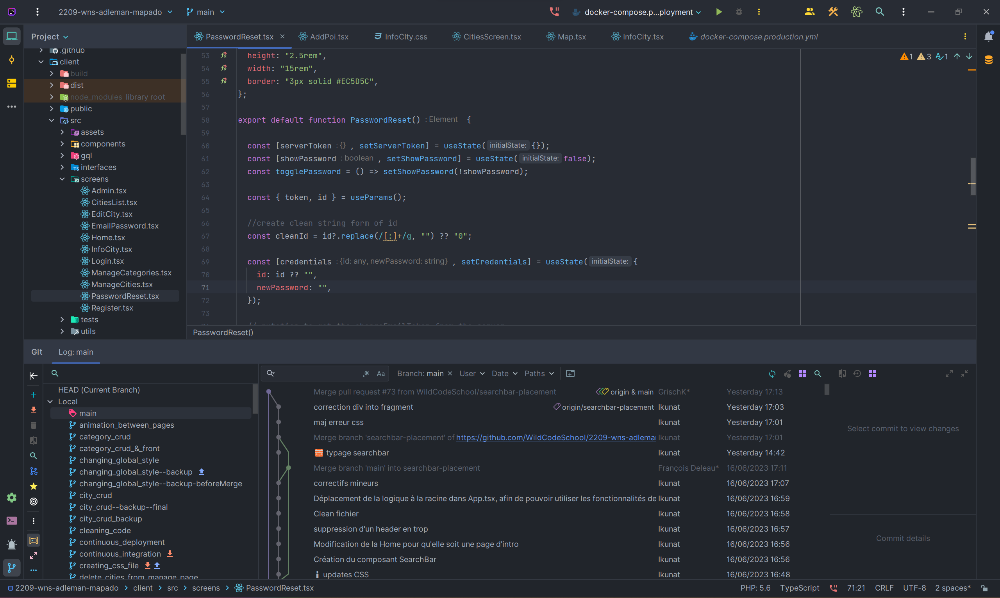

# GitHub

> ❌ A travailler

> ✔️ Auto validation par l'étudiant

## 🎓 J'ai compris et je peux expliquer

- l'initialisation d'un projet ✔️

  L'initialisation d'un projet sur GitHub consiste à créer un nouveau dépôt (repository) en ligne pour héberger et versionner les fichiers de notre projet. On peut également y inviter les membres de notre équipe, définir la gestion des branches (règle de push, PR...).

- travailler avec des branches ✔️

  Une branche est une copie du code source principale qui permet de travailler sur ce dernier sans en changer le contenu pour les autres collaborateurs. 
  La commande ```git checkout -b <NOM_DE_LA_BRANCHE>``` permet de créer une nouvelle branche depuis celle dans laquelle on se trouve.

- faire une PR ✔️

  PR signifie Pull Request. Lorsqu'on 'push' notre branche sur le repo, on peut alors créer une PR afin de 'merge' (fusionner) notre branche sur une autre branche, ou plus généralement, sur la branche principale (main).
  Une PR permet de gérer les conflits de merge, de le commenter, de demander l'approbation avant de merger le code.

- utiliser git rebase pour faire des commits propres ✔️

  ```git rebase``` permet de récupérer l'historique des commits d'une branche et de les intégrer dans la chronologie de la branche sur laquelle se base notre code. Cela facilite la lecture de l'historique du projet.

- utiliser les gitHub actions ✔️

  Github action est une fonctionnalité intégrée à GitHub qui consiste à créer un flux de travail automatisé, déclenché par des événements spécifiques tels que les Pull Request (PR), pour exécuter par exemple des tests.

## 💻 J'utilise

### Un exemple personnel commenté ✔️
- Capture d'écran du Git Version Control dans PhPStorm pour aider à la gestion des branches, rebase, update, PR...


- [Lien de mon Github](https://github.com/GrischK)

### Utilisation dans un projet ✔️

- [Projet Mapado](https://github.com/WildCodeSchool/2209-wns-adleman-mapado).

  Description : Projet de soutenance au Titre de Concepteur Développeur d'Applications

### Utilisation en production si applicable ✔️

### Utilisation en environnement professionnel ✔️

Description : Utilisation quotidienne sur tous les projets

## 🌐 J'utilise des ressources

### Titre

- [Commandes Git](https://git-scm.com/docs/git).
  Liste des commandes git  

- [MDN](https://developer.mozilla.org/fr/docs/Learn/Common_questions/Tools_and_setup/Using_GitHub_pages).
  Ressources MDN sur Github 

- [Exercice GitHub](https://learngitbranching.js.org/?locale=fr_FR).
  Exercice Github pour appréhender les branches

## 🚧 Je franchis les obstacles

### Point de blocage ✔️

## 📽️ J'en fais la démonstration

- J'ai écrit un [tutoriel]() ❌ 
- J'ai fait une [présentation]() ❌ 
